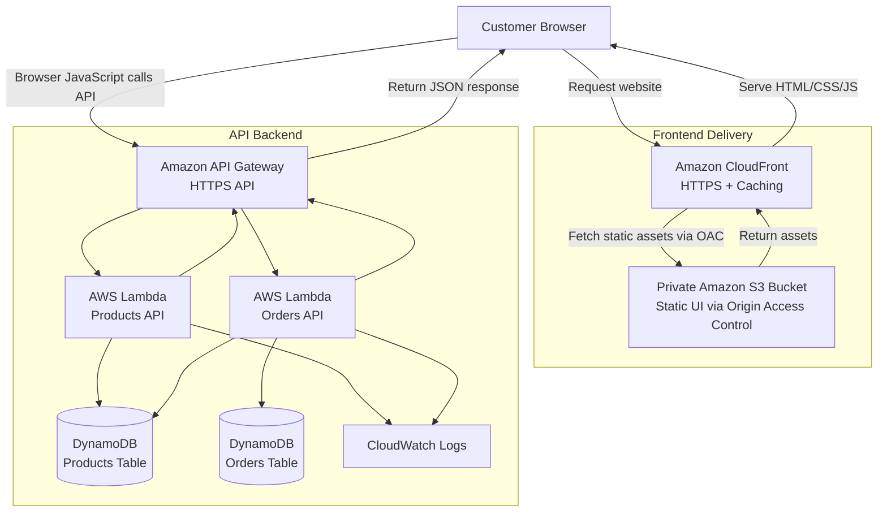
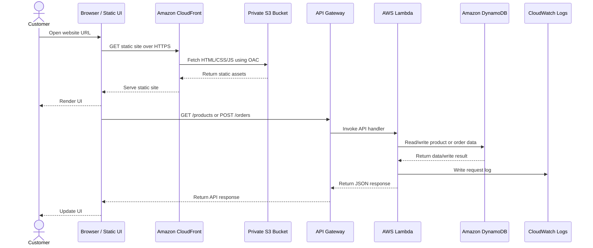
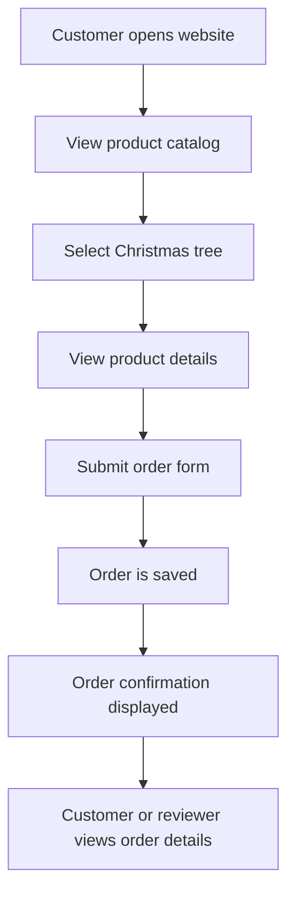
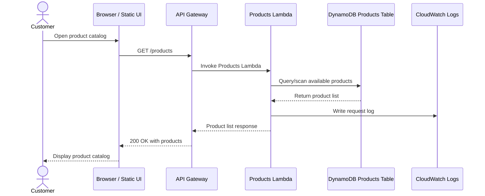
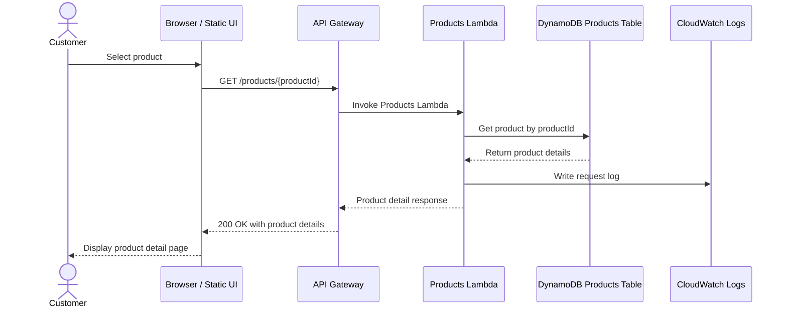
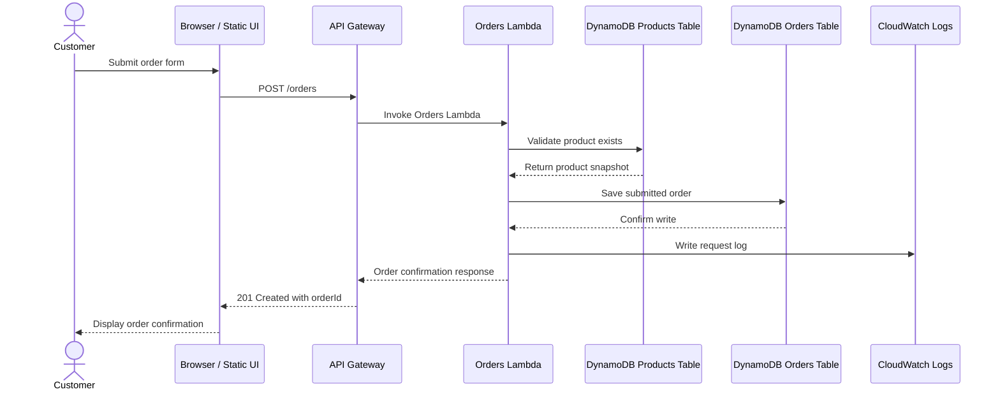
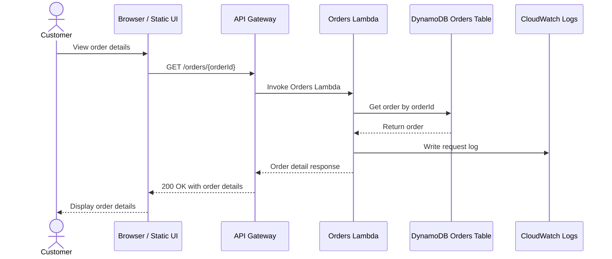
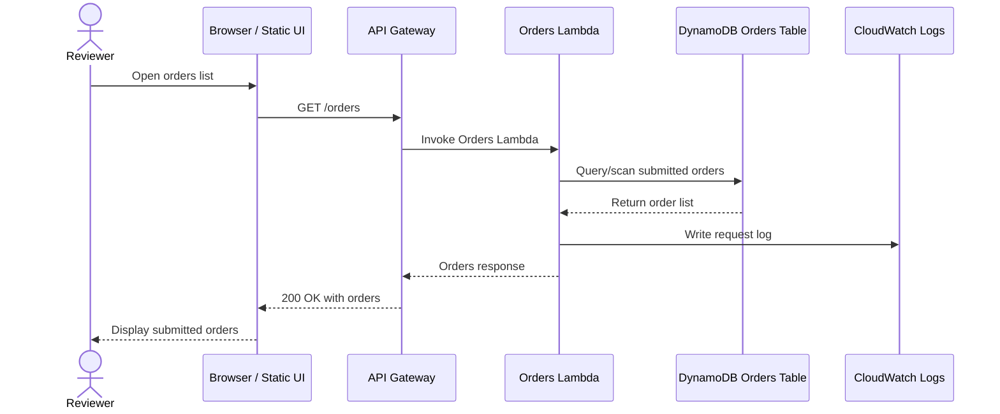
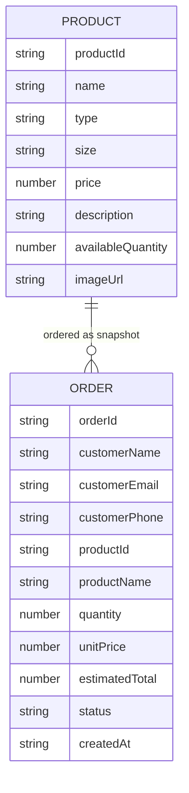
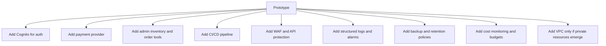

# Architecture Diagram and Request Flow

## 1. High-Level Architecture

## 2. Architecture Summary

The prototype uses a simple serverless AWS architecture.

| Layer | Component |
|---|---|
| User interface | Static HTML/CSS/JavaScript frontend |
| Frontend hosting | Amazon S3 |
| Content delivery | Amazon CloudFront |
| API layer | Amazon API Gateway |
| Backend logic | AWS Lambda |
| Data persistence | Amazon DynamoDB |
| Logging | Amazon CloudWatch |

## 3. Frontend Delivery and API Transaction Separation

CloudFront and S3 serve only the static frontend. They do not directly call the backend.

Once the browser loads the static HTML/CSS/JavaScript application, browser-side JavaScript calls API Gateway over HTTPS. API Gateway invokes Lambda functions, Lambda interacts with DynamoDB, and JSON responses return through API Gateway to the browser.

## 4. End-to-End Request / Response Sequence

## 5. Customer Journey Flow

## 6. API Request Flows

### 6.1 Product Catalog Request Flow

### 6.2 Product Detail Request Flow

### 6.3 Order Submission Request Flow

### 6.4 Order Detail Request Flow

### 6.5 Order List Request Flow

## 7. Data Model Diagram

## 8. Production Evolution View

